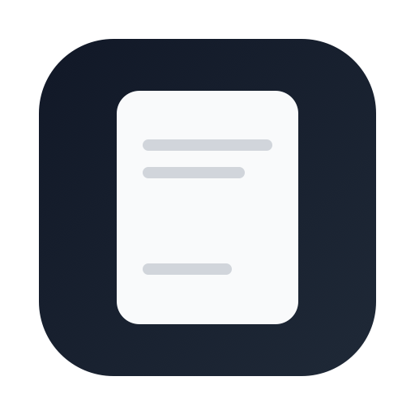

# TokDown



**Talk in. Markdown out.**

TokDown is a macOS menu bar app that records system audio or microphone input and transcribes it to markdown — entirely on-device, using Apple's new [SpeechTranscriber](https://developer.apple.com/documentation/speech/speechtranscriber) API introduced in macOS Tahoe (macOS 26).

## Apple's on-device transcription (WWDC 2025, macOS 26 Tahoe)

At WWDC in June 2025, Apple introduced [SpeechTranscriber](https://developer.apple.com/documentation/speech/speechtranscriber) — a ground-up replacement for the decade-old `SFSpeechRecognizer`. It shipped with macOS 26 Tahoe in fall 2025. TokDown is built on it.

### Why this matters

|  | Whisper (local) | Whisper API (OpenAI) | Otter / Fireflies | **TokDown** |
|---|---|---|---|---|
| Install | Python + ~3 GB model | None (API call) | None (SaaS) | **None — macOS has the model** |
| Speed (30 min audio) | 3-10 min | ~1 min | Real-time | **~30-45 sec** |
| Cost | Free | ~$0.18/hr | $8-24/mo | **Free** |
| Audio leaves your Mac | No | Yes | Yes | **No** |
| Quality (vs Whisper Large V3) | Baseline | Baseline | Comparable | **Comparable** |
| Languages | 99 | 57 | ~30 | **41** |
| Dependencies | Python, ffmpeg, model weights | API key | Account + subscription | **None** |

The model runs on the Neural Engine. macOS downloads the language model on first use (~150 MB, shared across all apps) and updates it automatically. No Python, no Homebrew, no Docker, no model files to manage.

Quality is comparable to Whisper Large V3 on conversational speech. It handles distant-mic scenarios well — meetings where you're not wearing a headset. Proper nouns are the main weakness, same as every other engine.

41 languages supported including English, Spanish, French, German, Japanese, Korean, Mandarin, Cantonese, Portuguese, Arabic, and more.

## Why TokDown

Most transcription tools trap your notes in another app or SaaS dashboard. TokDown writes plain markdown files to a folder — searchable, versionable, and ready to feed into agents, prompts, and automations.

- Record meetings, calls, demos, and research audio from system audio or your microphone
- Get timestamped markdown with YAML front matter (calendar metadata, attendees, links)
- No audio files kept — temporary capture audio is deleted permanently after transcription
- No dependencies, no accounts, no API keys
- ~1,600 lines of Swift, no external packages

## How it works

1. Click the menu bar icon
2. Pick an upcoming calendar meeting or start recording immediately
3. Open Settings any time to choose whether TokDown records System Audio or Microphone by default
4. Stop when done
5. TokDown transcribes and saves a `.md` file — typically in under a minute
6. If system-audio capture never receives any audio, TokDown reports an error instead of saving an empty transcript
7. The latest transcript can be opened directly from the menu bar
8. On a successful transcript the temporary audio file is deleted permanently; if the transcript comes back empty, the audio is **kept** in the save folder so it can be re-transcribed or listened back

Transcripts are saved to `~/Documents/Transcripts/` by default:

```text
2026-03-09_17-38_Standup.md
2026-03-09_18-00_Quarterly_planning_kickoff.md
```

Meeting recordings use the calendar event title. Manual recordings infer a title from the transcript text. If two recordings share the same title within the same minute, TokDown appends `-2`, `-3`, and so on instead of overwriting the earlier file.

Raw audio is recorded to a TokDown-owned temporary session folder, used for transcription, then permanently deleted — **except** when transcription returns nothing usable, in which case the audio is moved into the save folder beside where the transcript would be, so a failed capture is recoverable instead of lost. The selected transcript folder otherwise receives markdown files only.

After a successful save, the menu bar shows **Open Latest Transcript** so the newest markdown file is one click away without changing the app's folder-first workflow.

## Transcript format

```markdown
---
title: "Standup"
source: "calendar_selection"
audio_source: "system_audio"
recording_started_at: "2026-03-09T14:00:00-04:00"
recording_ended_at: "2026-03-09T14:30:00-04:00"
calendar: "Work"
event_start: "2026-03-09T14:00:00-04:00"
event_end: "2026-03-09T14:30:00-04:00"
location: "Zoom"
url: "https://zoom.us/j/123"
organizer:
  name: "Jane Doe"
  email: "jane@example.com"
attendees:
  - name: "Jane Doe"
    email: "jane@example.com"
  - name: "Alex Smith"
    email: "alex@example.com"
notes: |
  Agenda and invite notes.
---

# Standup

2026-03-09 14:00–14:30

[00:05] First chunk of transcribed text grouped by ~5s windows.

[00:10] Next chunk continues here with natural grouping.
```

Manual recordings use the same shape but omit calendar-specific fields.

## Requirements

- macOS 26+ (Tahoe)
- Apple Silicon or Intel Mac with Neural Engine support

## Build from source

```bash
swift test
bash scripts/build-app.sh debug
open TokDown.app
```

If your Mac has multiple code-signing identities, select one explicitly:

```bash
SIGNING_IDENTITY="Apple Development: Your Name (TEAMID)" bash scripts/build-app.sh debug
```

TokDown is a menu bar app — it lives in the menu bar, not the Dock.

Release build:

```bash
bash scripts/build-app.sh release
```

## Install from GitHub Releases

1. Download `TokDown.app.zip` from the [Releases](../../releases) page
2. Unzip and move `TokDown.app` to `/Applications`
3. Launch — if macOS warns on first run, right-click → **Open**

Open **Settings** from the menu bar to change the save folder and persist the default audio input across relaunches.

## Permissions

On first relevant use, macOS may prompt for:

- **Audio Recording** — captures system audio via a Core Audio process tap when System Audio is selected (survives lid-closed / display-off, unlike screen capture)
- **Microphone** — captures live microphone input when Microphone is selected, or as a fallback for System Audio when that option is enabled
- **Speech Recognition** — checked before recording starts because transcription is required for the end-to-end flow
- **Calendar** (optional, full access) — shows upcoming meetings in the menu; write-only access is not enough to read them

## Stack

~1,600 lines of Swift 6. No external dependencies.

| Framework | Purpose |
|---|---|
| Speech (SpeechTranscriber) | On-device transcription — new in macOS 26 |
| Core Audio (process tap) | System audio capture — `AudioHardwareCreateProcessTap` + aggregate device |
| AVFoundation | Audio recording and file I/O |
| EventKit | Calendar meeting integration |

## Architecture

```text
Sources/TokDown/
├── TokDownApp.swift            # App entry point
├── MenuBarCoordinator.swift    # State machine (idle → recording → transcribing)
├── MenuBarIconView.swift       # Custom menu bar icon states
├── MenuBarViews.swift          # Menu bar + Settings window
├── SystemAudioService.swift    # Core Audio process-tap capture + level metering
├── RecordingService.swift      # AVAudioRecorder (mic fallback)
├── TranscriptionService.swift  # SpeechTranscriber + SpeechAnalyzer pipeline
├── TranscriptFormatter.swift   # Front matter + markdown rendering
├── StorageService.swift        # Transcript paths and temporary audio cleanup
├── CalendarService.swift       # EventKit meetings
├── SettingsStore.swift         # User preferences
├── AppModels.swift             # Data types
└── Resources/
    ├── Info.plist
    ├── TokDown.entitlements
    ├── TokDownIcon.png         # Preferred app icon source (→ .icns at build time)
    └── TokDownIcon.svg         # Fallback icon source
```

## License

MIT
