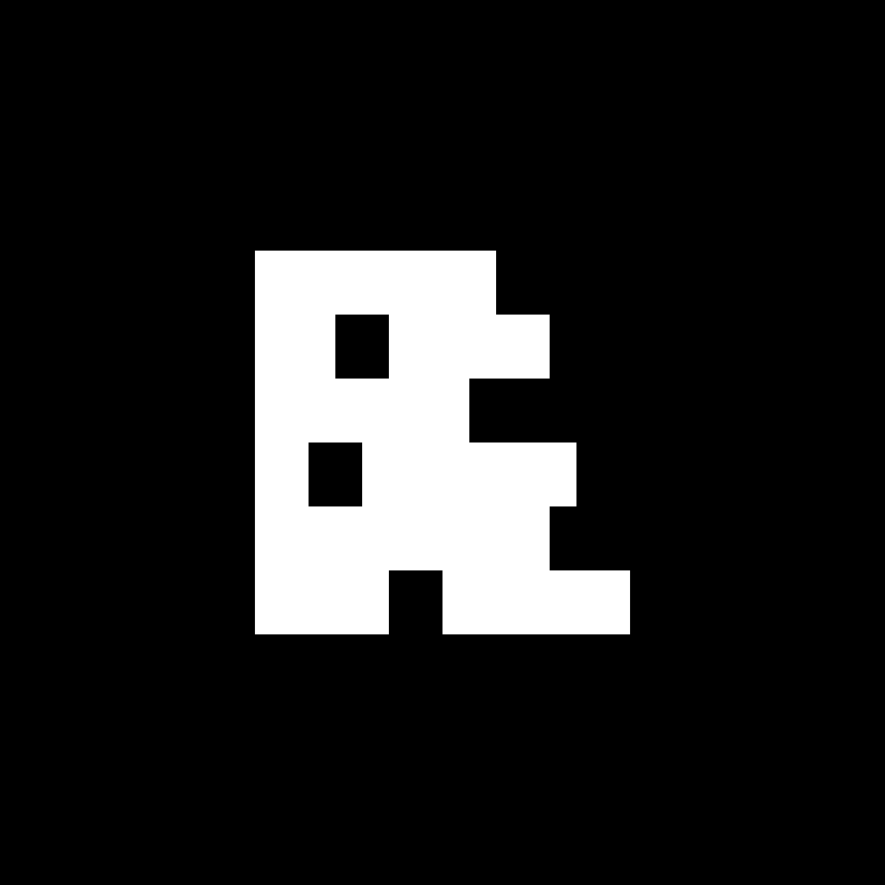

# TokDown



**Talk in. Markdown out.**

TokDown is a macOS menu bar app that records everyone in a meeting — the people heard through system audio plus the person using the Mac's microphone — and transcribes the conversation to markdown entirely on-device. A microphone-only mode is available for dictation and in-person conversations. It uses Apple's new [SpeechTranscriber](https://developer.apple.com/documentation/speech/speechtranscriber) API introduced in macOS Tahoe (macOS 26).

## Install

```bash
brew install scty-inc/tap/tokdown
```

Or download `TokDown.app.zip` from [Releases](../../releases), unzip, and move `TokDown.app` to `/Applications`. Requires macOS 26. Builds are notarized.

TokDown lives in the menu bar, not the Dock. Open **Settings** from the menu to change the save folder and choose Meeting Audio or Microphone Only.

## Why TokDown

Most transcription tools trap your notes in another app or SaaS dashboard. TokDown writes plain markdown files to a folder — searchable, versionable, and ready to feed into agents, prompts, and automations.

- Record both sides of meetings and calls, with or without headphones
- Get timestamped markdown with YAML front matter (calendar metadata, attendees, links)
- No audio kept after a good transcript — temporary capture audio is deleted permanently; it is kept only when transcription fails, so nothing is silently lost
- No dependencies, no accounts, no API keys in the macOS app
- Plain Swift using Apple frameworks; transcription runs on-device, and macOS downloads the speech model on first use

## How it works

1. Click the menu bar icon
2. Pick an upcoming calendar meeting or start recording immediately
3. Leave **Meeting Audio** selected to record both system output and your microphone, or choose **Microphone Only** for dictation and in-person conversations
4. Stop when done
5. TokDown combines the two meeting tracks locally, transcribes them, and saves a `.md` file — typically in under a minute
6. If either meeting track fails, TokDown reports the incomplete capture instead of silently presenting it as a complete meeting
7. The latest transcript can be opened directly from the menu bar
8. On a successful transcript all temporary audio is deleted permanently; if transcription or audio preparation fails, recoverable audio is **kept** in the save folder

Transcripts are saved to `~/Documents/Transcripts/` by default:

```text
2026-03-09_17-38_Standup.md
2026-03-09_18-00_Quarterly_planning_kickoff.md
```

Meeting recordings use the calendar event title. Manual recordings infer a title from the transcript text. If two recordings share the same title within the same minute, TokDown appends `-2`, `-3`, and so on instead of overwriting the earlier file.

Raw audio is recorded to a TokDown-owned temporary session folder. Meeting Audio captures system output and microphone into separate temporary tracks, combines them locally into one transcription input, and permanently deletes the source tracks. The combined audio is also deleted after successful transcription. If transcription or mixing returns nothing usable, recoverable audio is moved into the save folder so the meeting is not silently lost. The selected transcript folder otherwise receives markdown files only.

After a successful save, the menu bar shows **Open Latest Transcript** so the newest markdown file is one click away without changing the app's folder-first workflow.

## Transcript format

```markdown
---
title: "Standup"
source: "calendar_selection"
calendar_provider: "apple_calendar"
audio_source: "system_audio_and_microphone"
recording_started_at: "2026-03-09T14:00:00-04:00"
recording_ended_at: "2026-03-09T14:30:00-04:00"
calendar: "Work"
event_id: "abc123"
event_start: "2026-03-09T14:00:00-04:00"
event_end: "2026-03-09T14:30:00-04:00"
location: "Zoom"
url: "https://zoom.us/j/123"
organizer:
  name: "Jane Doe"
  email: "jane@example.com"
attendees:
  - name: "Jane Doe"
    email: "jane@example.com"
  - name: "Alex Smith"
    email: "alex@example.com"
notes: |
  Agenda and invite notes.
---

# Standup

2026-03-09 14:00–14:30

[00:05] First chunk of transcribed text grouped by ~5s windows.

[00:10] Next chunk continues here with natural grouping.
```

Manual recordings use the same shape but omit calendar-specific fields.

## Permissions

On first relevant use, macOS may prompt for:

- **Audio Recording** — captures the people heard through system audio as one part of Meeting Audio (survives lid-closed / display-off, unlike screen capture)
- **Microphone** — captures the local speaker for Meeting Audio, or the complete recording in Microphone Only mode
- **Calendar** (optional, full access) — shows upcoming meetings in the menu; write-only access is not enough to read them

## Build from source

```bash
swift test
bash scripts/build-app.sh debug
open TokDown.app
```

With several signing identities, pick one: `SIGNING_IDENTITY="Apple Development: …" bash scripts/build-app.sh debug`. Release and notarization steps are in [AGENTS.md](AGENTS.md).

## Stack

Plain Swift 6, no dependencies. This repo also holds an iOS companion for the Limitless Pendant in [`Apps/iOS/`](Apps/iOS/).

| Framework | Purpose |
|---|---|
| Speech (SpeechTranscriber) | On-device transcription — new in macOS 26 |
| Core Audio (process tap) | System audio capture — `AudioHardwareCreateProcessTap` + aggregate device |
| AVFoundation | Audio recording and file I/O |
| EventKit | Calendar meeting integration |

## License

MIT
